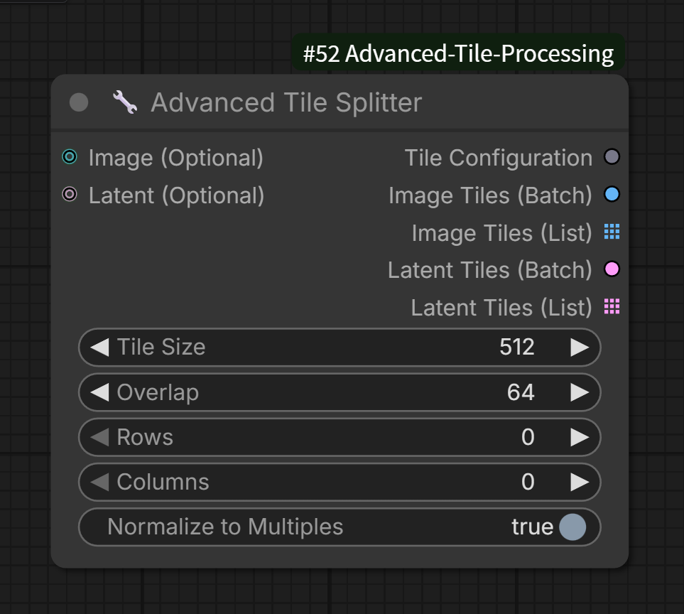
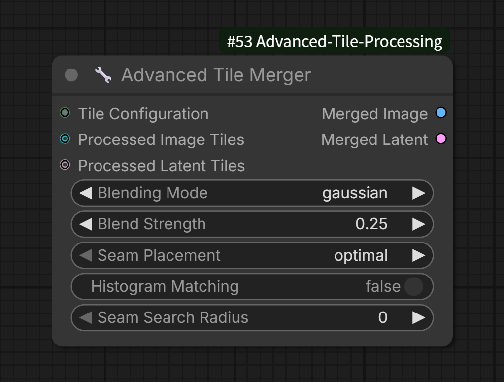
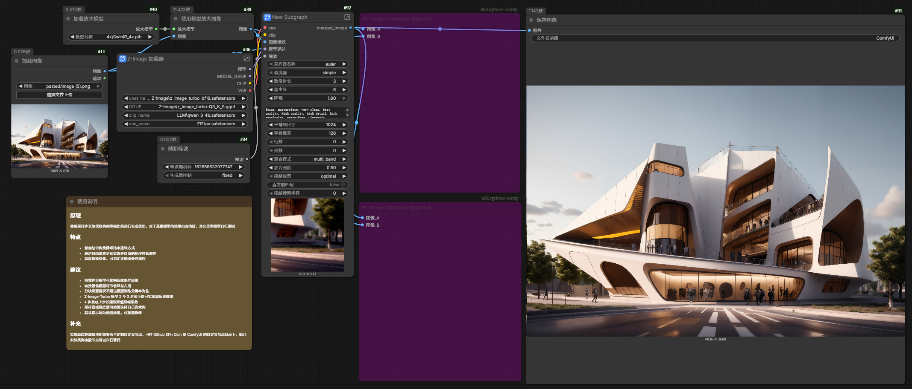

# ComfyUI-Advanced-Tile-Processing
[中文](README_CN.md) [English](README.md)

**ComfyUI-Advanced-Tile-Processing** 是一套专为 ComfyUI 设计的高级自定义节点插件。它旨在解决超高分辨率图像生成和处理中的显存瓶颈（VRAM OOM），通过智能分块（Tiling）与多种高级融合技术的无缝合并（Merging），让您能够在普通消费级显卡上稳定处理 4K、8K 甚至更高规格的图像。

## 🌟 核心特性

- **智能维度感知 (Smart Dimension Awareness)**：自动计算最优切片坐标。支持"边缘回退"策略，确保分块完全覆盖原始图像，无需引入黑边（Padding）从而避免模型产生伪影。
- **多种高级融合技术**：支持线性混合、高斯混合、多频段融合（Laplacian Pyramid）和直接拼接四种模式。
- **历史图匹配 (Histogram Matching)**：基于Reinhard算法，在融合前对相邻分块进行颜色分布匹配，消除色差。
- **最优接缝线计算 (Optimal Seamline)**：支持动态规划和中间线两种接缝模式，可限制搜索半径，自动寻找最小能量路径，避免切割重要内容。
- **元数据驱动流 (Metadata-Driven Workflow)**：Splitter 生成唯一的 `TILE_CONFIG` 对象，包含原始尺寸、缩放因子及坐标。Merger 自动读取配置一键还原，用户无需手动对齐参数。
- **深度兼容性**：完美适配 ComfyUI 的列表执行机制。支持将分块作为 `BATCH` 提交以获得最高推理速度，或作为 `LIST` 提交以支持循环节点处理。显存不足的情况下推荐 `LIST` 替代 `BATCH`。
- **高性能架构**：完全基于 PyTorch 张量运算，GPU 加速，保证处理大图时性能在线。
- **动态尺寸支持 (Tiled Upscale)**：支持动态尺寸调整（Tiled Upscale），在分块后进行放大处理。Merger 能够自动检测片段尺寸变化并动态调整画布大小。

## 🛠 安装说明

1. **环境要求**：ComfyUI 0.4.0+，Python 3.10+，PyTorch 2.0+。

2. 进入您的 ComfyUI 自定义节点目录：

```
cd ComfyUI/custom_nodes/
```

3. 克隆本仓库：
```
git clone https://github.com/QL-boy/ComfyUI-Advanced-Tile-Processing.git
```

4. 重启 ComfyUI。

## 🧩 节点详解

### 1. 🔧 Advanced Tile Splitter (高级分块器)


将输入的大图或 Latent 空间分割成重叠的小块。

- **输入端口**:
    - `image`: (可选) 原始图像。
    - `latent`: (可选) 潜在空间数据。

- **核心参数**:
    - `tile_size`: 分块分辨率（如 512, 1024）。
    - `overlap`: 两个分块之间的重叠像素。建议设为 `tile_size` 的 10% 及以上以获得最佳融合效果。
    - `rows`: 固定行数（设为0时自动计算）。
    - `columns`: 固定列数（设为0时自动计算）。
    - `normalize`: 是否将尺寸对齐到64的倍数（推荐开启以保证兼容性）。

- **输出端口**:
    - `tile_config`: 核心配置文件（必需连接至 Merger），包含合并所需的所有元数据。
    - `tiles_image_batch`: 将所有分块合并为一个 Batch Tensor，适合高性能采样。
    - `tiles_image_list`: (List 模式) 分块图像列表，触发 ComfyUI 循环执行。
    - `tiles_latent_batch`: 合并的 Latent Batch。
    - `tiles_latent_list`: (List 模式) 分块 Latent 列表。

### 2. 🔧 Advanced Tile Merger (高级合并器)


根据分块配置将处理后的片段无缝还原。

- **输入端口**:
    - `tile_config`: 由 Splitter 输出的配置对象。
    - `processed_tiles_image`: (可选) 处理后的图像片段。
    - `processed_tiles_latent`: (可选) 处理后的 Latent 片段。

- **核心参数**:
    - `blend_mode`: 融合模式
        - `linear`: 线性混合。
        - `gaussian` (默认): 高斯权重混合，中心权重高，边缘平滑衰减，融合效果最自然。
        - `multi_band`: 多频段融合（Laplacian Pyramid），最高质量的融合效果，适用于高对比度边缘。
        - `none`: 硬边缘拼接（会有明显接缝）。
    - `blend_strength`: 融合强度，控制羽化程度。
    - `seam_mode`: 接缝线模式
        - `optimal`: 动态规划计算最小能量路径。
        - `middle`: 直接使用重叠区域的中心线。
    - `histogram_matching`: 是否启用历史图匹配，消除相邻分块间的色差。
    - `seam_search_radius`: 接缝线搜索半径，限制接缝线在中心线附近波动。

- **输出端口**:
    - `merged_image`: 合并后的完整图像。
    - `merged_latent`: 合并后的完整 Latent。

- **内部机制**:
    节点会自动解包 `LIST` 输入。如果您的上游是循环节点，请确保所有分块均已处理完成再输入 Merger。

## 📖 核心算法原理

### 1. 分块策略
分块器采用智能坐标计算，确保：
- 完全覆盖原始图像，无遗漏区域
- 重叠区域均匀分布
- 支持固定行列数或自动计算
- 支持尺寸对齐到8或64的倍数

### 2. 多模式融合技术

#### A. 线性混合 (Linear Blending)
在重叠区域进行简单的线性插值，快速但可能在边缘产生模糊。

#### B. 高斯混合 (Gaussian Blending)
使用高斯核函数生成权重掩码，中心权重高，边缘平滑衰减：
$$ M(x,y) = e^{-\frac{(x-x_c)^2+(y-y_c)^2}{2\sigma^2}} $$

#### C. 多频段融合 (Multi-band Blending)
基于拉普拉斯金字塔的高质量融合：
1. 构建图像的高斯金字塔和拉普拉斯金字塔
2. 在每一层分别融合
3. 从顶层重建图像

优势：
- 保留高频细节
- 平滑过渡低频信息
- 消除鬼影效应

#### D. 最优接缝线 (Optimal Seamline)
通过动态规划计算最小能量路径：
$$ E_{total} = E_{color} + \lambda \cdot E_{geometry} $$

其中：
- $E_{color}$ 为颜色差异
- $E_{geometry}$ 为几何约束（保持接近中心线）
- $\lambda$ 为平衡参数

### 3. 历史图匹配 (Histogram Matching)
基于Reinhard算法，将源图像的统计特性匹配到参考图像：
$$ I_{matched} = \frac{(I - \mu_s)}{\sigma_s} \times \sigma_t + \mu_t $$

其中：
- $\mu_s, \sigma_s$ 为源图像的均值和标准差
- $\mu_t, \sigma_t$ 为目标图像的均值和标准差

### 4. Latent空间合并
对于Latent空间，采用简化的"中心裁剪"策略：
- 每个分块在重叠区域内取中心部分
- 直接拼接到画布，无融合
- 8倍下采样对应处理

## 🚀 使用建议

### 最佳实践配置

| 场景 | 推荐参数 |
|------|----------|
| 普通图像拼接 | overlap=64, blend_mode="gaussian", blend_strength=0.25 |
| 高对比度图像 | overlap=128, blend_mode="multi_band", blend_strength=0.3 |
| 有显著色差 | 开启histogram_matching，seam_mode="optimal" |
| 速度优先 | blend_mode="linear", seam_mode="middle" |

### 性能优化
1. **Batch模式**：当分块数较少（≤4）且显存充足时，使用Batch模式获得最高性能
2. **List模式**：分块数多或显存紧张时，使用List模式逐个处理
3. **搜索半径**：设置适当seam_search_radius（如10-20）可加速最优接缝计算

### 常见工作流
### SDXL 经典分块采样高清修复复刻


### Z-Image质量升级


## ⚠️ 常见问题 (FAQ)

- **Q: 为什么合并后的图边缘还是有淡淡的印子？**
    - A: 尝试增加 `overlap` (建议不低于 64) 并确保 `blend_mode` 设为 `gaussian` 或 `multi_band`。同时，检查重绘时的 `denoise` 是否过高，过高的降噪会导致分块内容产生剧烈变化。

- **Q: 支持 Latent 空间合并吗？**
    - A: 支持。但由于 VAE 编码器的特性，Latent 空间的重叠合并采用硬切割，可能会在 Decode 后出现微小色差，通常推荐在 Image 空间执行最终合并。

- **Q: 多频段融合速度很慢怎么办？**
    - A: 多频段融合需要构建图像金字塔，确实较慢。对于实时性要求高的场景，建议使用gaussian模式。也可以减少金字塔层数（代码中默认为5层）。

- **Q: 最优接缝线计算出现异常切割怎么办？**
    - A: 可尝试增加 `seam_search_radius` 限制接缝线在中心附近，或直接使用 `seam_mode="middle"`。

- **Q: 为什么我连接了节点却输出了多张图？**
    - A: 请确保您使用的是 `Advanced Tile Merger` 并正确连接了 `tile_config`。如果输出依然是列表，请检查是否在 Merger 之后又连接了不支持 List 的旧版节点。

## 📊 技术规格

- **最大支持尺寸**：理论无限制，取决于系统内存
- **分块最大数量**：32×32网格
- **数据类型**：支持float32, float16, bfloat16
- **设备支持**：CUDA GPU（推荐），CPU（较慢）
- **依赖库**：
  - torch >= 2.0.0
  - numpy >= 1.20.0
  - scipy >= 1.7.0（用于高斯滤波）

## 🔧 开发说明

### 扩展接口
插件注册了自定义类型 `TILE_CONFIG`，可通过以下方式扩展：
```python
from comfy.graph_utils import GraphBuilder
GraphBuilder.add_node_type("TILE_CONFIG", lambda x: isinstance(x, dict) and "splits" in x)
```

### 模块结构
```
ComfyUI-Advanced-Tile-Processing/
├── __init__.py              # 节点注册
├── nodes/
│   ├── tile_splitter.py     # 分块器
│   ├── tile_merger.py       # 合并器
├── utils/
│   └── blending.py          # 融合算法
└── README_CN.md             # 中文文档
```

## 🤝 贡献与反馈

欢迎提交 Issue 或 Pull Request。如果您在使用中发现本项目可以改进的地方，请随时联系。

## 📜 许可说明

本项目基于 [Apache-2.0 license](https://github.com/QL-boy/comfyui-ps-plugin#Apache-2.0-1-ov-file) 许可证开源。